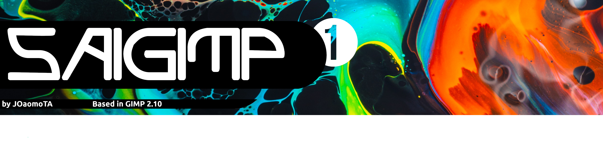

  

<h3 align="center"> <a href="https://github.com/JOaomoTAa17319/SAIgimp/releases/download/continuous/SAIgimp-x86_64.AppImage">Download Linux AppImage</a>

  
# 🌟 Features

It comes with the standard tools of the Gimp project and some features, like:

- Tool Organization to look like the SAI's interface;
- New Splash Screen;
- Dark Mode;
- Multi Language: system language is now used by default, you can still change in settings if you want.
- Drawing Tablet support
- Cool styled fonts
- and more...

# 📷 Screenshots
<h1 align="center">

 

</h1>

# 🔷 How to install (Linux AppImage Edition)

1. Click on [download link](https://github.com/JOaomoTAa17319/SAIgimp/releases/download/continuous/SAIgimp-x86_64.AppImage)
2. Click on "Properties" go to Permission tab and check "make it execuble" or similar
3. Do a double click on "SAIgimp-x86_64.AppImage"

# 📦 How to install (if you use GIMP via Flatpak)

1. Download "SAIgimp for Linux.tar.xz"

2. Extract all folders to your /home folder.

3. Search on menu:

<h1 align="center">

</h1>

